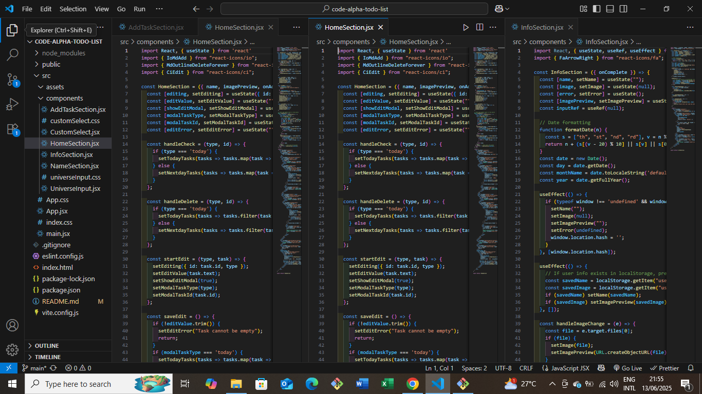

# ✅ To-Do List Application

A simple and elegant **To-Do List App** built with **React** to help users manage daily tasks efficiently. This project was developed as part of my ongoing **internship at Staxtech**, focused on mastering real-world frontend development practices.

---

## 🚀 Features

- ✅ Add new tasks
- ✏️ Edit existing tasks
- 🗑️ Delete tasks
- 📌 Mark tasks as completed
- 🌙 Clean and responsive user interface
- 💾 Local storage integration

## 🛠️ Tech Stack

- ⚛️ **React** (with functional components and hooks)
- 🎨 **CSS** (plain CSS for custom styling)
- 💡 **React Icons** for visual enhancements
- 🌐 Deployed on **Vercel**

